# a-walk-in-the-park
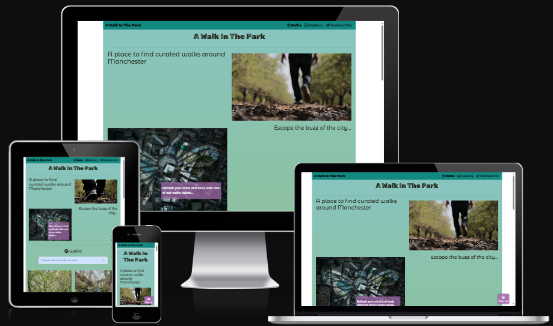
## project purpose
 A site for local walkers or visitors to the area of Greater Manchester. The sites main purpose is to get people to sign up to the newsletter by engaging those who are interested in finding both popular walks and the hidden gems for those seeking a more quiet and natural atmosphere. The aim of the site's design will be to engage users by giving them easy viewing and finding of walks with a gallery to entice them to sign-up and walk in the area. Walks will be rated, give estimated walk distance, location and show an image in each card.
## User Stories
Who, Why, Because...

1. A visitor to the area of Manchester wants to find a list of walks accompanied with images created by locals to pick a walk before investing travel time.
- Essential: Bootstrap cards provide an image, location text and button which opens to show a google maps pin of the location. href in the button opens a googlemaps dropped pin.
2. A new visitor to the site wants to find local curated walks which quickly highlight how long and difficult a walk is to ensure it is appropriate for their level of fitness.
- Essential: Bootstrap cards contain walk length in Km and difficulty rating in stars
3. A Frequent site user wants to view more/ new walks in a date of post format added to the listings before picking one for the weekend. 
- Low value: This feature utilises JS and is out of scope. 
4. A frequent user wants to see if the walks suit their families fitness or accessbility level when viewing walk cards.
-Nice to have: Requires a set of icons which would be easily identifiable for their purpose such as a wheelchair for wheelchair access. 
5. A returning user wants to sign up for the newsletter so they can be kept informed of any newly added walks and also to send a list of selected walks to their inbox.
- Essential: A fixed signup button is in the bottom right corner. Clicking this opens a modal form which requires validated Name and Email to subscribe. In this application, data is sent to a mock database (codeinstitute form dump)
6. A returning user wants to be able to provide feedback by contacting the site admin in a Contact Us section.
- Essential: The contact us page has a form where free text can be entered along with selecting a reason for contact in a drop down box.
7. A frequent user wants to view an image gallery and find out where the picture was taken so this place can be picked for walking.
- Essential: A gallery page of all the pictures in an appealing masonry format.
-Nice to have: Should have CSS `hover` rules. Display the image location overlayed with the image.
## Features
Bootstrap encourages Mobile first development. Bootstrap's design is most efficient on mobile devices and readily scales to portrait, tablet, laptop and greater sized screens whilst maintaining responsiveness. 
### Homepage
 The site landing page. Utilises Bootstrap grids, navbar, modal and cards. The first section comprises of a Large title, an autoplay looped and muted video followed by an aerial shot of Manchester city with the bee overlayed on top with a . A large button "Sign up" opens a Bootstrap Modal form. The first thing a new visitor sees is the banner title and a short looping video of a person walking into the distance. The signup button remains in a fixed position in the bottom right corner so a user can easily choose to open the form from anywhere on the homepage. An image of Manchester City is overlayed with a bee - synonamous with Manchester - and is used to contrast with the following natural imagery in the walk cards. The cards contain a relevant image, card title, distance, difficulty rating, walk type and location. Common icons were chosen to easily show intent without a descriptive word. The card button will open a new tab and direct the user to a googlemaps dropped pin where the area resides. The footer contains links to popular Social media sites and uses their respective logos.

 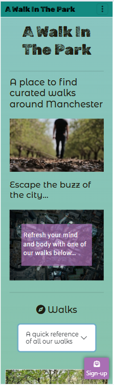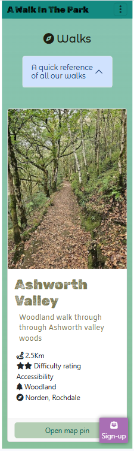
 #### Modal form
 The modal opens upon clicking the signup button. It shows a form for the user to complete and requires the following: First and Last name as text. Email address with format checking ( @ symbol in an email). Submit button which only works when all information is valid.
 ### Gallery 
 This page contains a masonry styled image gallery. On mouse hover, some image text is overlayed.
### Design
#### Colour scheme
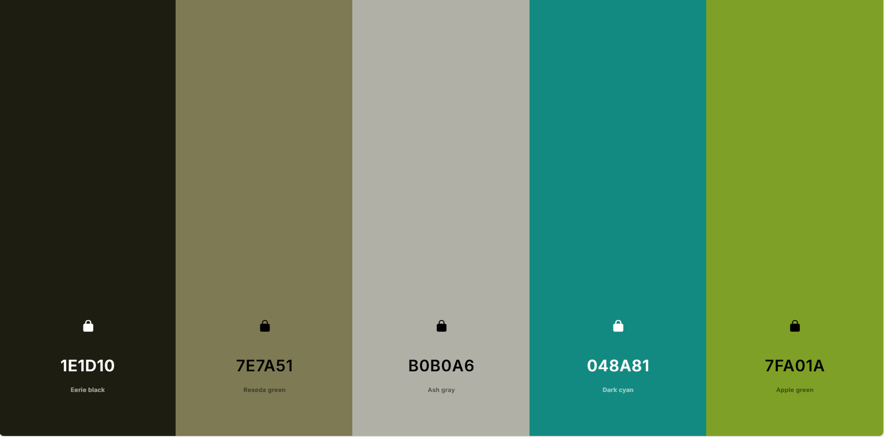
Coolors was used to help generate a pleasing, natural feeling colour palette consisting of earthy tones. The Dark Cyan and Apple Green feature heavily as background colours. Eerie black is the main font colour.
#### Fonts
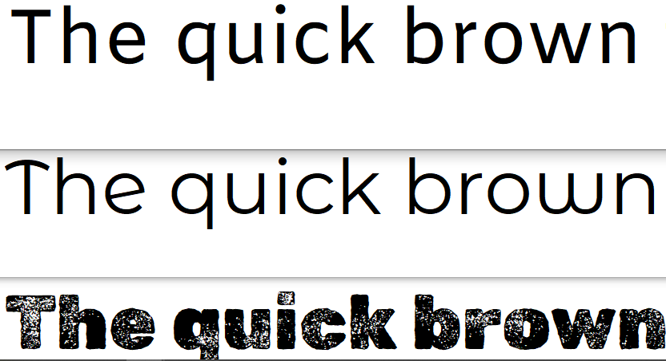
Fonts were chosen on GoogleFonts.
Rubik Dirt is used for H1 headings and card titles.
Montserrat Alternates is used for smaller headings and sub-headings.
Main block text font uses Amiko.
#### Imagery

Images used are of local areas around the Greater Manchester area and other than the video are all genuine images. Images were selected to highlight the areas of natural beauty and to insipire site visitors to want to experience the areas shown themselves. 
### Wireframes
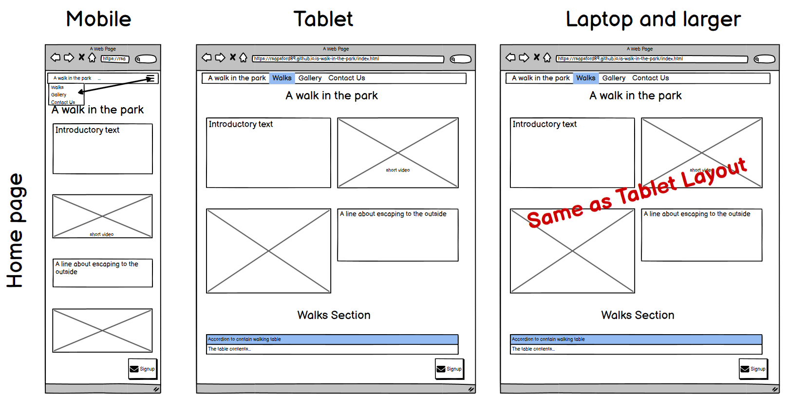
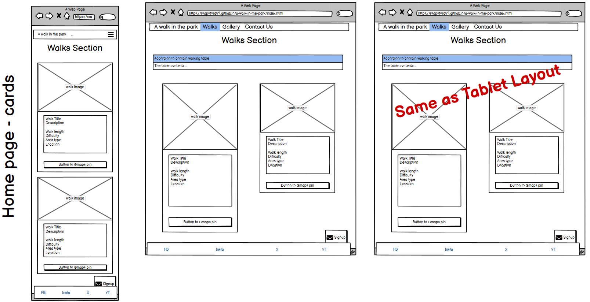
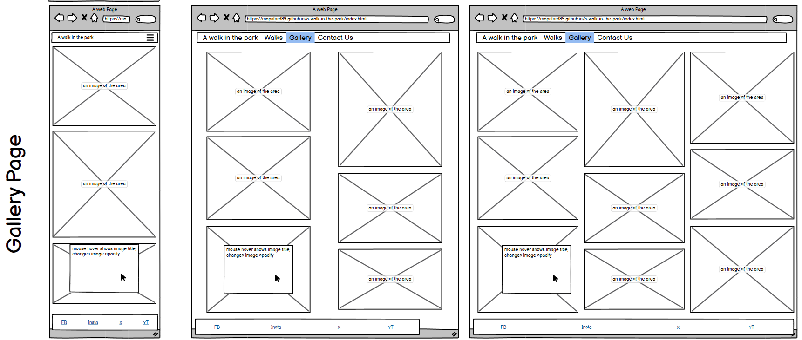
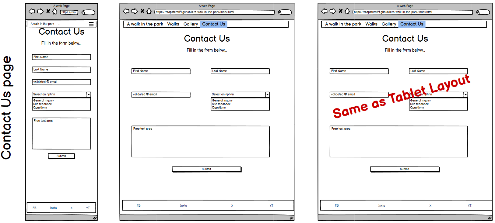
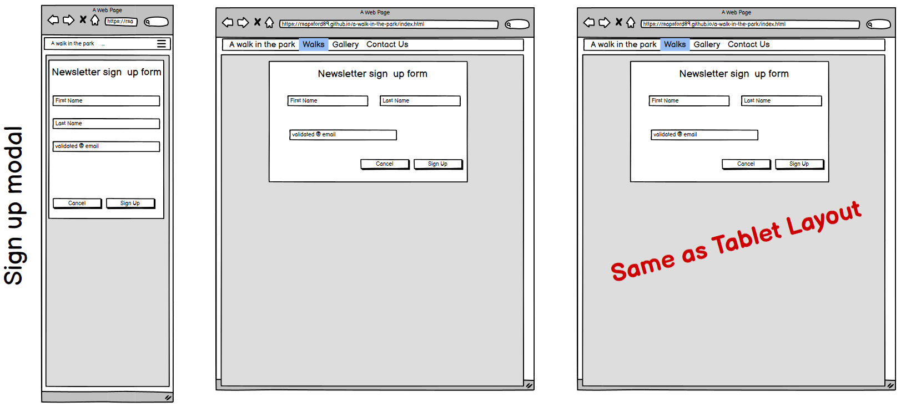
## Technology
Bootstrap 5.3* used to assist with the styling and responsiveness. In particular, it was required for the gallery and Walk cards.

GoogleFonts used to acquire appropriate friendly fonts to give a welcoming and casual feel to the sites text. Amiko, Montseratt Alternates and Rubik Dirt.

FontAwesome used to get some outdoor and walking related icons for use throughout the headings

Coolors was used to generate contrasting colour palettes: https://coolors.co/

To create documentation imagery, AmIResponsive can display the site on different media sizes: https://ui.dev/amiresponsive

For the landing video, Coverr was used: https://coverr.co/

Microsoft's Copilot AI was used to help generate the bee image. 
## Testing
Testing was carried out using the following methods:
* running Lighthouse on each live page
* putting HTML through the W3C validator on each live page
* putting CSS through the W3C validator on each live page
* responsiveness manual testing from 320px wide to 1440px wide screens
* form entry manual testing
* user testing for bug and feedback
### Lighthouse reports
#### index page
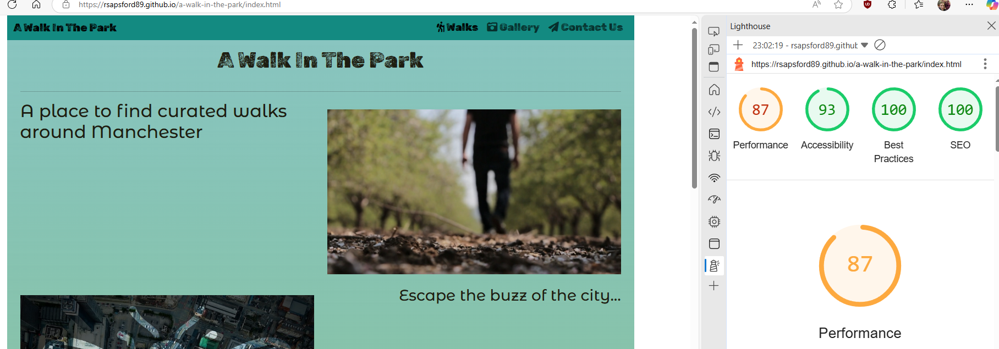
#### Contact Us page
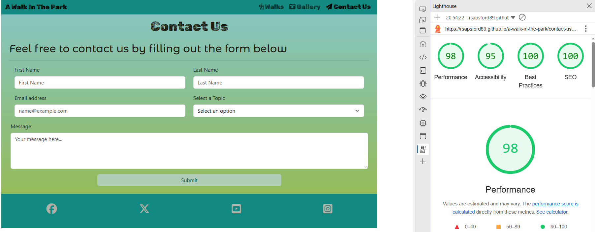

#### Gallery page
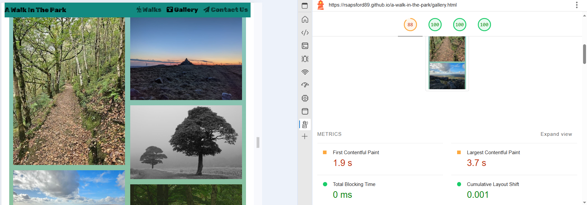
Initial testing results show clear performance issues related to image loading. Lighthouse suggests changing image formats.
## Deployment
Deployment is done using Github and Github Pages. 

### Repo
The project repository is here:
https://github.com/RSapsford89/a-walk-in-the-park

The repository consists of the main branch and one merged branch 'new-homepage-layout'. Midway through the project, feedback suggested a more spacious and better colour palette would suit the site's design better. Once the new page layout and colours had been built and tested on it's own branch it could then be merged to the Main branch.

Github Projects was used to log some bugs and feature changes through the development of the site. This is the kanban style visual layout to help monitor tasks and also mark off completed ones:
 https://github.com/users/RSapsford89/projects/1

### Page Hosting

The page link is:
https://rsapsford89.github.io/a-walk-in-the-park/

Hosting is carried out via Github Pages. The creation of this is done by choosing which branch of the project you wish to be made live in the Project > Settings > Pages area. By selecting Main, the most recently pushed 'main' branch is made the live, viewable page.

## Future Improvements

* signup btn should change to better contrasting colour
* sort out the buttons! Colors once highlighted/pressed should not be blue.
* overlay first line to the embed video in sm view?
* semantics need adding/checking
* are img titles req? y
* reduce max vp width at large sizes - its too wide!
* AmIResponsive
* HTML and CSS validation
* cards need hidden descriptive words for accessibility reasons! (distance for the map icon etx)

