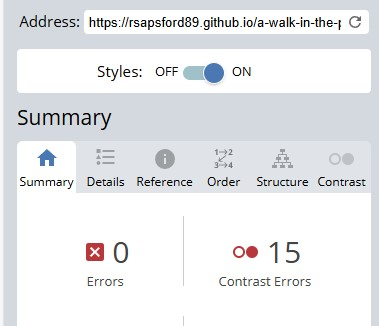

# a-walk-in-the-park

## project purpose
 A site for local walkers or visitors to the area of Greater Manchester. The sites main purpose is to get people to sign up to the newsletter by engaging those who are interested in finding both popular walks and the hidden gems for those seeking a more quiet and natural atmosphere. The aim of the site's design will be to engage users by giving them easy viewing and finding of walks with a gallery to entice them to sign-up and walk in the area. Walks will be rated, give estimated walk distance, location and show an image in each card.

## User Stories
Who, Why, Because...

### New Visitor
1. A visitor to the area of Manchester wants to find a list of walks accompanied with images created by locals to pick a walk before investing travel time.
- Essential: Bootstrap cards provide an image, location text and button which opens to show a google maps pin of the location. href in the button opens a googlemaps dropped pin.
2. A new visitor to the site wants to find local curated walks which quickly highlight how long and difficult a walk is to ensure it is appropriate for their level of fitness.
- Essential: Bootstrap cards contain walk length in Km and difficulty rating in stars

### Returning Visitor
 1. A returning user wants to sign up for the newsletter so they can be kept informed of any newly added walks and also to send a list of selected walks to their inbox.
- Essential: A fixed signup button is in the bottom right corner. Clicking this opens a modal form which requires validated Name and Email to subscribe. In this application, data is sent to a mock database (codeinstitute form dump)
2. A returning user wants to be able to provide feedback by contacting the site admin in a Contact Us section.
- Essential: The contact us page has a form where free text can be entered along with selecting a reason for contact in a drop down box.

### Frequent Visitor
1. A Frequent site user wants to view more/ new walks in a date of post format added to the listings before picking one for the weekend. 
- Low value: This feature utilises JS and is out of scope. 
2. A frequent user wants to see if the walks suit their families fitness or accessbility level when viewing walk cards.
-Nice to have: Requires a set of icons which would be easily identifiable for their purpose such as a wheelchair for wheelchair access. 
3. A frequent user wants to view an image gallery and find out where the picture was taken so this place can be picked for walking.
- Essential: A gallery page of all the pictures in an appealing masonry format.
-Nice to have: Should have CSS `hover` rules. Display the image location overlayed with the image.

## Features
Bootstrap encourages Mobile first development. Bootstrap's design is most efficient on mobile devices and readily scales to portrait, tablet, laptop and greater sized screens whilst maintaining responsiveness. 

### Homepage
 The site landing page. Utilises Bootstrap grids, navbar, modal and cards. The first section comprises of a Large title, an autoplay looped and muted video followed by an aerial shot of Manchester city with the bee overlayed on top with. A large button "Sign up" opens a Bootstrap Modal form. The first thing a new visitor sees is the banner title and a short looping video of a person walking into the distance. The signup button remains in a fixed position in the bottom right corner so a user can easily choose to open the form from anywhere on the homepage. An image of Manchester City is overlayed with a bee - synonamous with Manchester - and is used to contrast with the following natural imagery in the walk cards. The cards contain a relevant image, card title, distance, difficulty rating, walk type and location. Common icons were chosen to easily show intent without a descriptive word. The card button will open a new tab and direct the user to a googlemaps dropped pin where the area resides. The footer contains links to popular Social media sites and uses their respective logos.

 

 #### Modal form
 The modal opens upon clicking the signup button. It shows a form for the user to complete and requires the following: First and Last name as text. Email address with format checking ( @ symbol in an email). Submit button which only works when all information is valid.

 ### Gallery 
 This page contains a masonry styled image gallery. On mouse hover, some image text is overlayed.

 The masonry style layout takes ideas from: 
 * BootStrap 5 documentation: https://getbootstrap.com/docs/5.3/components/card/#masonry & https://getbootstrap.com/docs/5.3/examples/masonry/
  - Shows the use of `display: block` 
 * The BootStrap linked masonry page: https://masonry.desandro.com/ 
  - The idea of using the overflow to change how the end of column content flows, hidden gave a nice look for the page due to the different sized images and mix of layout and portait
### Design
#### Colour scheme

Coolors was used to help generate a pleasing, natural feeling colour palette consisting of earthy tones. The Dark Cyan and Apple Green feature heavily as background colours. Eerie black is the main font colour.

#### Fonts

Fonts were chosen on GoogleFonts.
Rubik Dirt is used for H1 headings and card titles.
Montserrat Alternates is used for smaller headings and sub-headings.
Main block text font uses Amiko.

#### Imagery
Images used are of local areas around the Greater Manchester area and other than the video are all genuine images. Images were selected to highlight the areas of natural beauty and to insipire site visitors to want to experience the areas shown themselves. 

### Wireframes


## Technology
A summary of technology used to create the website is below, an expanded section is in the Credits section:
* languages used are HTML and CSS
* Software development was written in VS code: https://code.visualstudio.com/
* Debugging and testing was carried out in Microsoft's Edge broswer using DevTools: https://www.microsoft.com/en-us/edge/?form=MA13RE?ocid=ORSEARCH_Bing
* Balsamiq was used to create wireframes: https://balsamiq.com/
* Bootstrap was used for responsiveness design across the site: https://getbootstrap.com/
### Code
Bootstrap 5.3* used to assist with the styling and responsiveness. In particular, it was required for the gallery and Walk cards.

The general layout and responsiveness comes from the Grids with Order noted further down the docs.: https://getbootstrap.com/docs/5.3/layout/grid/ 
```
 <div class="container text-center">
  <div class="row">
    <div class="col">
      Where content 
    </div>
    <div class="col">
      Is added
    </div>
    <div class="col">
      here
    </div>
  </div>
</div>
```
The Cards are based on the basic card example code with the addition of the footer with custom button to open a blank page navigating to a Google Maps pin. A list is used for the content with Font Awesome icons. Card docs: https://getbootstrap.com/docs/5.3/components/card/
```
<div class="card" style="width: 18rem;">
  
  <div class="card-body">
    <h5 class="card-title">Card title</h5>
    <p class="card-text">Some quick example text to build on the card title and make up the bulk of the card’s content.</p>
    <a href="#" class="btn btn-primary">Go somewhere</a>
  </div>
</div>
```
The accordion, which features on viewports wider than `mobile`, was based upon the basic accordion. Inside the `accordion-body` is a basic table format with `table-hover` so the user can see which line is highlighted. Accordion doc:
```
 <div class="accordion" id="accordionExample">
  <div class="accordion-item">
    <h2 class="accordion-header">
      <button class="accordion-button" type="button" data-bs-toggle="collapse" data-bs-target="#collapseOne" aria-expanded="true" aria-controls="collapseOne">
        Accordion Item #1
      </button>
    </h2>
    <div id="collapseOne" class="accordion-collapse collapse show" data-bs-parent="#accordionExample">
      <div class="accordion-body">
        <strong>This is the first item’s accordion body.</strong> It is shown by default, until the collapse plugin adds the appropriate classes that we use to style each element. These classes control the overall appearance, as well as the showing and hiding via CSS transitions. You can modify any of this with custom CSS or overriding our default variables. It’s also worth noting that just about any HTML can go within the <code>.accordion-body</code>, though the transition does limit overflow.
      </div>
    </div>
  </div>
</div>
```

The navbar is based on the Navbar 'nav' example with additions to add underlining for active link and fix position to top of viewport. Navbar doc: https://getbootstrap.com/docs/5.3/components/navbar/#nav
```
<nav class="navbar navbar-expand-lg bg-body-tertiary">
  <div class="container-fluid">
    <a class="navbar-brand" href="#">Navbar</a>
    <button class="navbar-toggler" type="button" data-bs-toggle="collapse" data-bs-target="#navbarNav" aria-controls="navbarNav" aria-expanded="false" aria-label="Toggle navigation">
      <span class="navbar-toggler-icon"></span>
    </button>
    <div class="collapse navbar-collapse" id="navbarNav">
      <ul class="navbar-nav">
        <li class="nav-item">
          <a class="nav-link active" aria-current="page" href="#">Home</a>
        </li>
        <li class="nav-item">
          <a class="nav-link" href="#">Features</a>
        </li>
        <li class="nav-item">
          <a class="nav-link" href="#">Pricing</a>
        </li>
        <li class="nav-item">
          <a class="nav-link disabled" aria-disabled="true">Disabled</a>
        </li>
      </ul>
    </div>
  </div>
</nav>
```

The modal form comprises of a floating `button` and `form` within a `modal`. It uses custom button code and the basic modal example code with custom form, with inspiration from the Code Institure Mei Portfolio, utilising grids for neater layout and responsiveness. Modal doc: https://getbootstrap.com/docs/5.3/components/accordion/
```
<div class="modal" tabindex="-1">
  <div class="modal-dialog">
    <div class="modal-content">
      <div class="modal-header">
        <h5 class="modal-title">Modal title</h5>
        <button type="button" class="btn-close" data-bs-dismiss="modal" aria-label="Close"></button>
      </div>
      <div class="modal-body">
        <p>Modal body text goes here.</p>
      </div>
      <div class="modal-footer">
        <button type="button" class="btn btn-secondary" data-bs-dismiss="modal">Close</button>
        <button type="button" class="btn btn-primary">Save changes</button>
      </div>
    </div>
  </div>
</div>
```
The modal form used in https://github.com/RSapsford89/bootstrap-Mei-portfolio/blob/main/index.html:
```
 <div class="modal-body">
          Join my newsletter for the latest updates on my projects, coding tips, and industry insights
          delivered straight to your inbox!
        </div>
        <div class="container">
          <div class="row g-3">
            <div class="col-12 col-md-6">
              <label for="full-name" class="form-label">Full Name</label>
              <input type="text" class="form-control" id="full-name">
            </div>
            <div class="col-12 col-md-6">
              <label for="email-address" class="form-label">Email</label>
              <input type="email" class="form-control" id="email-address" placeholder="rob@ert.com">
            </div>
            <div class="col-12 mb-4">
              <button type="button" class="btn btn-primary">Sign up!</button>
```
The gallery page utilised the power of Bootstrap grids and CSS styling to get the feel of a true JavaScript Masonry layout without the JS. All images are in a single divs and contained within `gallery-masonry`. This idea is based around the BootStrap cards-masonry information and the linked: https://masonry.desandro.com/ & https://getbootstrap.com/docs/5.3/components/card/#masonry By using media querys, the number of columns can be set from 1 for `mobile`, 2 for `tablet` and 3 for `large`. `column-count` determines the number to be displayed and was found on the CSS docs: https://developer.mozilla.org/en-US/docs/Web/CSS/column-count By inspecting the elements on the Desandro page I found that `display:block`, `overflow: <option>` and `position: absolute` were the biggest factors in the layout looking 'Masonry-esque'. Desandro element with position:
```
<div class="hero-grid__item" style="position: absolute; left: 49.9943%; top: 253.797px;"><a class="hero__example-link" href="http://erikjohanssonphoto.com/work/imagecats/personal/"><p class="hero__example-link__title">Erik Johansson</p></a></div>
```
Desandro CSS with the overflow setting:
```
img {
    overflow-clip-margin: content-box;
    overflow: clip;
}
```

The contact-us page is based on the Bootstrap form with grids to alter the layout for responsiveness. The action in the form was taken from the learning within Code Institutes Form lessons, for example:
```
<form action="https://formdump.codeinstitute.net/" method="POST">
            <input type="text" name="postdata">
```
The layout was based on the BootStrap form docs: https://getbootstrap.com/docs/5.3/forms/form-control/
```
<form class="row g-3">
  <div class="col-auto">
    <label for="staticEmail2" class="visually-hidden">Email</label>
    <input type="text" readonly class="form-control-plaintext" id="staticEmail2" value="email@example.com">
  </div>
  <div class="col-auto">
    <label for="inputPassword2" class="visually-hidden">Password</label>
    <input type="password" class="form-control" id="inputPassword2" placeholder="Password">
  </div>
  <div class="col-auto">
    <button type="submit" class="btn btn-primary mb-3">Confirm identity</button>
  </div>
</form>
```
Information for Form entry elements were taken from the HTML docs:
https://developer.mozilla.org/en-US/docs/Web/HTML/Reference/Elements/form

### Fonts
GoogleFonts used to acquire appropriate friendly fonts to give a welcoming and casual feel to the sites text. Amiko, Montseratt Alternates and Rubik Dirt.


FontAwesome used to get some outdoor and walking related icons for use throughout the headings


## Testing
Testing was carried out using the following methods:
* running Lighthouse on each live page
* putting HTML through the W3C validator on each live page
* putting CSS through the W3C validator on each live page
* responsiveness manual testing from 320px wide to 1440px wide screens
* form entry manual testing
* user testing for bug and feedback

### Lighthouse reports
Initial testing results show clear performance issues related to image loading in mobile settings. Lighthouse suggests changing image formats. Some experimentation with webp formats and reducing size of images only had marginal gains on performance. All images were changed to webp and video reduced to 480p had the largest gains in performance. All pages perform highly in desktop mode.

#### Homepage page


#### Contact Us page


#### Gallery page


### CSS validation


### HTML validation
#### Index

#### Gallery

#### Contact Us


### WAVE
WAVE was used to analyse accessiblity of the page. All errors found were related to contrast ratios between text and background. To fix the contrast errors, card, navbar and button font was made black. the signup button background was made darker.

#### Homepage


#### Gallery


#### Contact Us


## Deployment
Deployment is done using Github and Github Pages. 

### Repo
The project repository is here:
https://github.com/RSapsford89/a-walk-in-the-park

The repository consists of the main branch and one merged branch 'new-homepage-layout'. Midway through the project, feedback suggested a more spacious and better colour palette would suit the site's design better. Once the new page layout and colours had been built and tested on it's own branch it could then be merged to the Main branch.

Github Projects was used to log some bugs and feature changes through the development of the site. This is the kanban style visual layout to help monitor tasks and also mark off completed ones:
 https://github.com/users/RSapsford89/projects/1


### Page Hosting
The page link is:
https://rsapsford89.github.io/a-walk-in-the-park/

Hosting is carried out via Github Pages. The creation of this is done by choosing which branch of the project you wish to be made live in the Project > Settings > Pages area. By selecting Main, the most recently pushed 'main' branch is made the live, viewable page.

## Credits
Software development was done in VS code: https://code.visualstudio.com/

Debugging and testing was carried out in Microsoft's Edge broswer using DevTools: https://www.microsoft.com/en-us/edge/?form=MA13RE?ocid=ORSEARCH_Bing

Coolors was used to generate contrasting colour palettes: https://coolors.co/

Fonts were taken from Google Fonts: https://fonts.google.com/

Icons were found on Font Awesome: https://fontawesome.com/

Masonry gallery inspiration from: https://masonry.desandro.com/

To create documentation imagery, AmIResponsive can display the site on different media sizes: https://ui.dev/amiresponsive

For the landing video, Coverr was used: https://coverr.co/

Project and file hosting ustilised github: https://github.com/

With version control utilising Git: https://git-scm.com/downloads

Balsamiq was used to create wireframes: https://balsamiq.com/

For accessibility checking, WAVE was used: https://wave.webaim.org/

For HTML validation: https://validator.w3.org/#validate_by_input

For CSS validation: https://jigsaw.w3.org/css-validator/#validate_by_input

Bootstrap was used for responsiveness design across the site: https://getbootstrap.com/

Squoosh to reformat images into smaller dimensions and formats (webp): https://squoosh.app/

To change the favicon art to the correct size, favicon.io was used: https://favicon.io/favicon-converter/

My tutor, Spencer for assistance and pointers for page design and layout: https://spencers.studio/about

Microsoft's Copilot AI was used to help generate the bee image and a favicon pixel art image.

All other images are my own work.

## Bugs and Fixes
Throughout the development numerous bugs were fixed and incremental changes made to improve repsonsiveness, element positions and accessibility issues for example. 

WAVE contrast fixes required the changing of Navbar, Card and Footer font colours. This was mostly resolved using WAVE to get the report and then Devtools to change colours and inspect the 'ratio' reading when it appeared. 

Fixed page performance when using Lighthouse Mobile testing. Initial performance was very low (around the 60 mark) and the logs provided by Lighthouse suggested the format and payload of the video and images were too large. To improve this the image format and sizes were changed to be as small as is accpetable for viewer quality and change from png or jpg to webp. The video was reduced to 480p. 

Another page performance issue was reported by lighthouse to be the city and bee image with caption. After inspection and testing it appeared to be due to the fact that the position would change during load, which lowers the performance score greatly. I created a new combined image instead of using CSS styling to overlay the bee.webp with the city.webp for an overall improvement. 

The Footer across the gallery and contact pages were incorrectly set to 100% width because the elements were outside the container which set them to the proper width. By moving the elements to be within a container the CSS and Bootstrap rules would be applief so the correct margin is in place.

Initial implementation of the Gallery had images which would flow past my intended 'bottom'. This meant that portrait images appeared elongated when the following column had a shorter vertical landscape image. By changing the overflow styling used I could get the effect I wanted.

Initial implementation of the Gallery would result in images being overly wide between the chosen column media-query breakpoints. This resulted in oversized images and did not look like a Masonry layout inbetween breakpoints. Resolved by setting max width to 100% when the media-query sizes were correctly set in CSS and setting a maximum page width so that very-large screen sizes did not end up with stretched images either.

Card alignment was not working as intended, card margins were not spaced equally between columns. Fixed by using mx-auto in the Bootstrap classes.

Accordion display on mobile views would not display neatly due to the font size and columns in the table. It was decided that the table could be contained in an accordion and that this element could have the class `mobile-hidden` applied which used a media query to hide it from the page on small width screens.

During early development feedback from people who had seen the site was that the colours and layout were too cramped. A second branch was made to develop and test with a new layout which could then be merged if feedback was that this new layout was preferred. After showing the new layout, it was approved and merged into the main branch.

Gallery was intended to have the `hover` CSS style applied which would fade the image and show some title font to describe the image locations. Reading and testing with the `transistions` rules created the effect I desired but applied them across the site (including home page). To resolve, the rule was moved into `gallery-masonry img:hover` and this was applied to the masonry images only.

Inconsistent margins between sections and pages. Occassionaly the margins between sections would differ by some small number of pixels. Temporary CSS styling and Devtool debug was used to isolate the issue: inconsistent use of `container` and `container-fluid` and if content was nested inside grid `columns`. Reviewing and testing of site wide content re-aligned page margins and made them consistent throughout. 

### Remaining bugs
* margin on tablet size ( 2 columns of cards) is double thickness in the center. Either `mx-auto` isn't working as I intended it to, or another class is accidentally adding to each side regardless.

* Accordion width does not quite match the width of the cards on large size, but looks good on mobile, lg-mobile and tablet.
* The submitted site had a typo in the Lyme Park Google maps link! (has since been resolved)

## Future Improvements
* Add a menu to sort from newest to oldest walks
* use gmaps api to link or create in-page routes
* backend to store the data and respond with a 'thanks for subscribing email'


